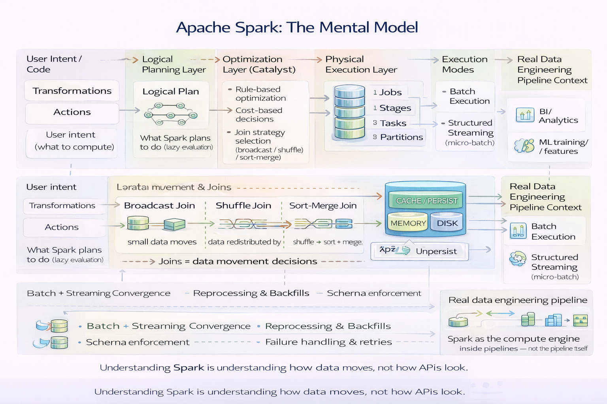

## **Apache Spark - The Mental Model**

## Contents

1. [What Apache Spark actually is](topic-01-what-apache-spark-is.md)
2. [Apache Spark Architecture](topic-02-spark-architecture.md)
3. [Spark data model: RDD, DataFrame, Dataset](topic-03-spark-data-model.md)
4. [Transformations vs Actions](topic-04-transformations-vs-actions.md)
5. [Spark Jobs, Stages, and Tasks](topic-05-jobs-stages-tasks.md)
6. [Partitions & Parallelism](topic-06-partitions-parallelism.md)
7. [Spark SQL & the Catalyst Optimizer](topic-07-spark-sql-catalyst.md)
8. [Spark Joins](topic-08-spark-joins.md)
9. [Caching & Persistence](topic-09-caching-persistence.md)
10. [Spark in real Data Engineering pipelines](topic-10-spark-in-real-pipelines.md)

That’s the difference between:

> _“I can write Spark code”_  
> and  
> _“I understand what Spark will do when I write code.”_

You’re firmly in the second camp. with above content.

