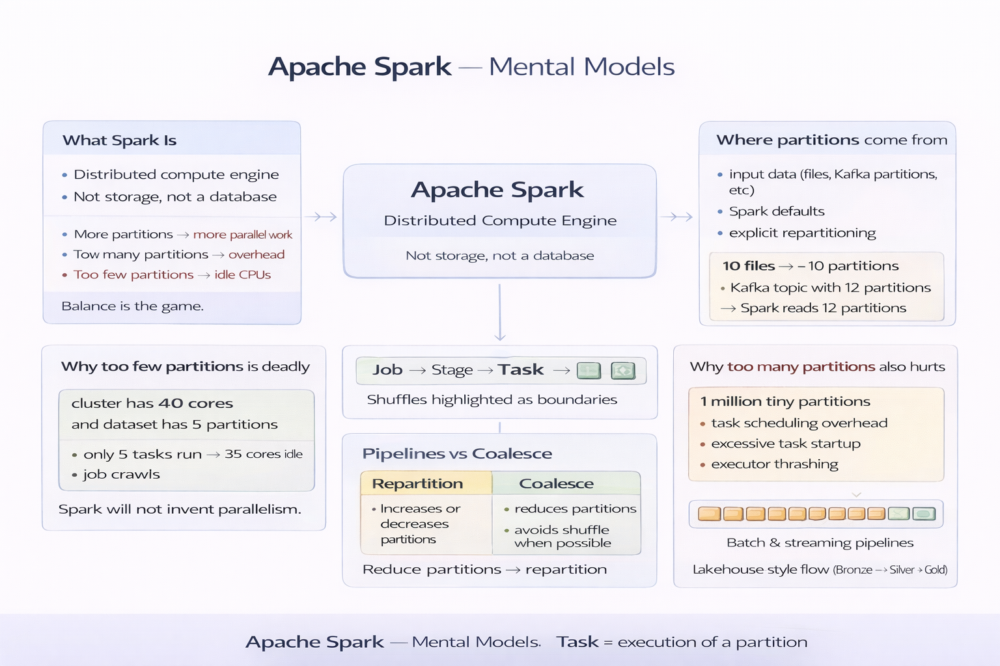

# Apache Spark — Mental Models

> A high-level mental map of how Apache Spark thinks and executes work.

This document captures **Spark’s core ideas as mental models**.
Each topic is summarized here.
Click a link only when you want depth.

---
## Topic 1 — What Apache Spark is  
**Mental Model**
- Distributed compute engine, not storage
- Describes *what*, Spark decides *how*
- Built for scale and failure
- Speed via parallelism + memory

→ [Deep dive](topics/topic-01-what-apache-spark-is.md)

---

## Topic 2 — Spark Architecture  
**Mental Model**
- Driver plans and coordinates
- Executors execute tasks
- Cluster manager allocates resources
- Driver failure = job failure

→ [Deep dive](topics/topic-02-spark-architecture.md)

---

## Topic 3 — Spark Data Model  
**Mental Model**
- RDD explains internals
- DataFrames enable optimization
- Schema unlocks performance
- Spark behaves like a compiler

→ [Deep dive](topics/topic-03-spark-data-model.md)

---

## Topic 4 — Transformations vs Actions  
**Mental Model**
- Transformations describe intent
- Actions trigger execution
- No action → no work
- One action executes many steps

→ [Deep dive](topics/topic-04-transformations-vs-actions.md)

---

## Topic 5 — Jobs, Stages, Tasks  
**Mental Model**
- Action creates a job
- Shuffle creates stage boundaries
- Tasks process partitions
- Most slowness comes from shuffles

→ [Deep dive](topics/topic-05-jobs-stages-tasks.md)

---

## Topic 6 — Partitions & Parallelism  
**Mental Model**
- Partition = unit of parallelism
- One partition → one task
- Too few = idle CPUs
- Too many = overhead
- Partitioning beats micro-optimizations

→ [Deep dive](topics/topic-06-partitions-parallelism.md)

---

## Topic 7 — Spark SQL & Catalyst  
**Mental Model**
- All APIs become SQL plans
- Catalyst rewrites logic
- High-level code performs better
- Trust optimizer before tuning

→ [Deep dive](topics/topic-07-spark-sql-catalyst.md)

---

## Topic 8 — Spark Joins  
**Mental Model**
- Joins move data across cluster
- Broadcast small datasets
- Big joins cause shuffles
- Skewed keys create stragglers

→ [Deep dive](topics/topic-08-spark-joins.md)

---

## Topic 9 — Caching & Persistence  
**Mental Model**
- Cache trades memory for recomputation
- Cache only reused data
- Memory is finite and shared
- Unpersist aggressively

→ [Deep dive](topics/topic-09-caching-persistence.md)

---

## Topic 10 — Spark in Data Engineering Pipelines  
**Mental Model**
- Spark is rarely the whole pipeline
- Owns heavy transformation layer
- Batch first, streaming when needed
- Storage + compute is a contract

→ [Deep dive](topics/topic-10-spark-in-real-pipelines.md)

---

That’s the difference between:

> _“I can write Spark code”_  
> and  
> _“I understand what Spark will do when I write code.”_

You’re firmly in the second camp with the content above.
