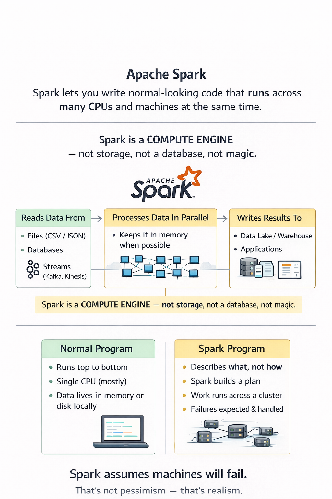

## **Topic 1 - What Apache Spark actually is (from zero)**

**Apache Spark** is a **distributed data processing engine**.  
Translation in human terms: Spark lets you write _normal-looking code_ that secretly runs across **many CPUs and machines at the same time**.

Before Spark, big data meant:

- slow batch jobs
- disk-heavy processing
- painful Java MapReduce

Spark flipped the table.

Here’s the mental model you need to lock in:

Spark is **not storage**.  
Spark is **not a database**.  
Spark is **not magic**.

Spark is a **compute engine**.

It:

- reads data from somewhere (files, databases, streams)
- processes it **in parallel**
- keeps data **in memory** when possible (this is the speed sauce)
- writes results somewhere else

You write code once. Spark figures out how to slice the work and spread it across machines.

### Spark vs traditional programs (intuition)

Normal program:

- runs top to bottom
- single CPU (mostly)
- data lives in memory or disk locally

Spark program:

- describes **what** you want, not **how**
- Spark builds a plan
- work runs across a cluster
- failures are expected and handled

Spark assumes machines will fail. That’s not pessimism—that’s realism.

