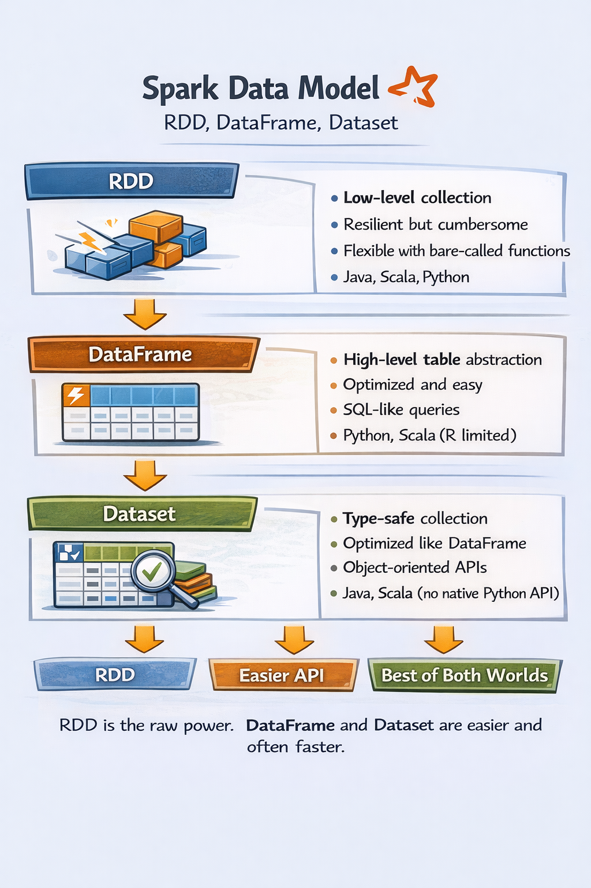
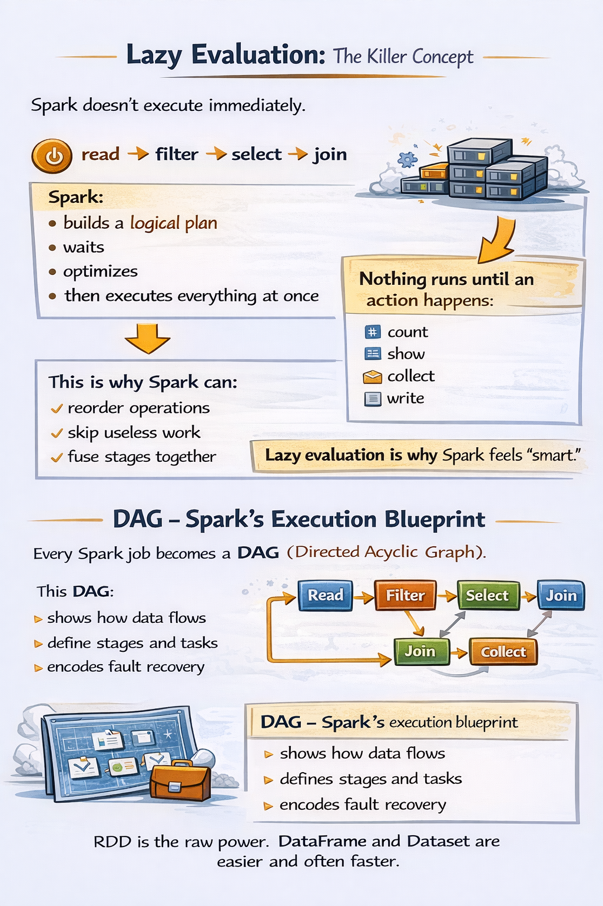

## **Topic 3 - Spark data model - RDD, DataFrame, Dataset (and why RDDs still matter)**

Spark has **three ways to represent data**.

### 1) RDD — the raw, primitive layer

**RDD (Resilient Distributed Dataset)** is the OG Spark abstraction.

**What it is:**
- an immutable collection of records
- split across partitions
- processed in parallel

**Why it mattered:**
- fault tolerance via lineage (recompute, don’t recover)
- explicit control over transformations
- foundation of Spark’s execution engine

Why you don’t use it much today:
- verbose
- no query optimization
- easy to shoot yourself in the foot performance-wise

RDDs are like assembly language.  
You don’t write apps in it, but the CPU still runs it.

---
### 2) DataFrame — the default weapon

A **DataFrame** is:
- distributed
- structured (rows + columns)
- schema-aware
- optimized by Spark
If you’ve used SQL tables or pandas, this feels familiar.

**Key upgrade:**  
Spark can now **understand your data**, not just push bytes around.

**That unlocks:**
- query optimization
- predicate pushdown
- column pruning
- whole-stage code generation

This is why DataFrames are fast.

---
### 3) Dataset — typed, but niche

**A Dataset is:**
- like a DataFrame
- but strongly typed (mainly in Scala/Java)

**Reality check:**
- widely used in Scala-heavy codebases
- rarely used in Python
- DataFrames dominate modern pipelines

For most data engineers:  
**RDD → understand**  
**DataFrame → use**  
**Dataset → recognize**



---
### The killer concept: Lazy Evaluation

Spark doesn’t execute immediately.

When you write:

```scss
read → filter → select → join
```

Spark:
- builds a **logical plan**
- waits
- optimizes
- then executes everything at once

Nothing runs until an **action** happens.

Examples of actions:
- count
- show
- collect
- write

This is why Spark can:

- reorder operations
- skip useless work
- fuse stages together

Lazy evaluation is why Spark feels “smart”.

---
### DAG — Spark’s execution blueprint

Every Spark job becomes a **DAG (Directed Acyclic Graph)**.

This DAG:

- shows how data flows
- defines stages and tasks
- encodes fault recovery

If a partition dies:  
Spark doesn’t panic.  
It **recomputes from lineage**.

That’s the “resilient” in RDD.

