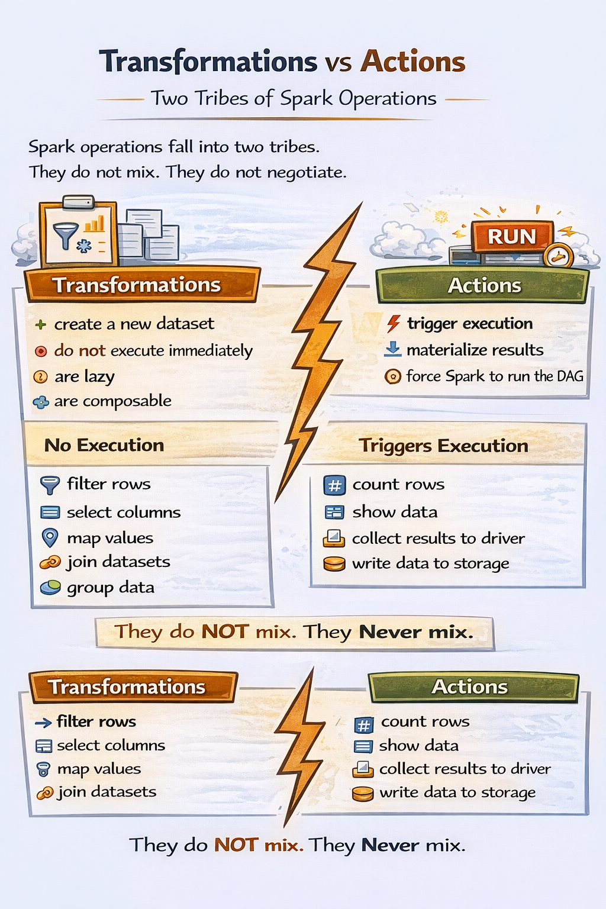
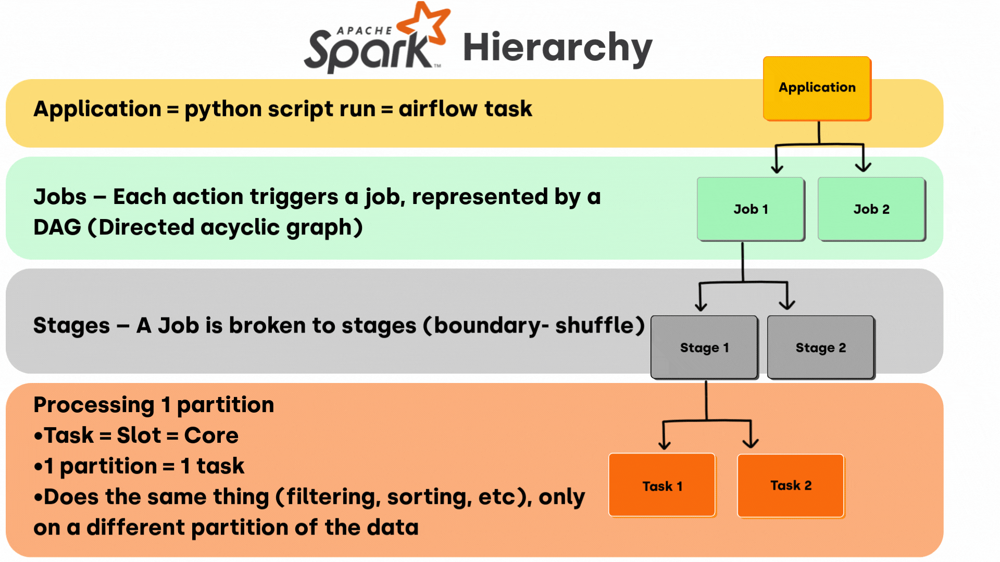

## **Topic 4 - Transformations vs Actions (planning vs execution)**

Spark operations fall into **two tribes**. They do not mix. They do not negotiate.
### Transformations — describing _what should happen_

**Transformations:**
- create a **new dataset**
- do **not** execute immediately
- are lazy
- are composable

**Examples (conceptually):**
- filter rows
- select columns
- map values
- join datasets
- group data
When you apply a transformation, Spark basically says:

> cool story, I’ll remember that

Nothing runs. No CPU burns. No cluster wakes up.

You’re just **building a plan**.

---
### Actions — “okay, now do it”

Actions:
- **trigger execution**
- materialize results
- force Spark to run the DAG

Examples:
- count rows
- show data
- collect results to driver
- write data to storage

The moment an action appears:
- Spark finalizes the plan
- optimizes it
- executes it across executors

No action = no execution. Ever.

---
### Why this split exists (deep reason)

Spark wants:
- global optimization
- fewer scans
- smarter execution

If Spark executed each step immediately, it would:
- re-read data repeatedly
- miss optimization opportunities
- be slow like old MapReduce

Lazy execution lets Spark act like a **query compiler**, not a script runner.

---
### Mental model to lock in

- Transformations = intentions
- Actions = execution
- Spark is a planner first, executor second
- One action can trigger many transformations

This single concept explains:
- performance
- debugging
- “why did Spark run this twice”
- “why nothing happened”

---
