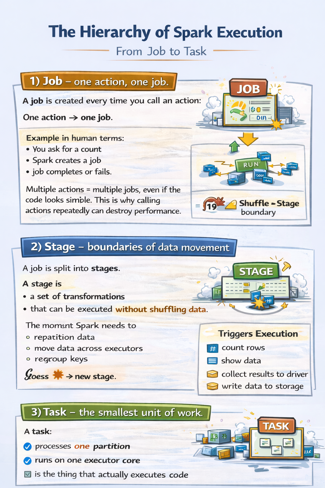

## **Topic 5 - Spark Jobs, Stages, and Tasks (how work is sliced)**

Spark doesn’t run “your code”.  
It runs **units of work**. Three layers deep.
- Job
- Stage
- Tasks
---
### 1) Job — one action, one job

A **job** is created every time you call an **action**.

One action → one job.

Example in human terms:
- you ask for a count
- Spark creates a job
- job completes or fails

Multiple actions = multiple jobs, even if the code looks similar.

This is why calling actions repeatedly can destroy performance.

---
### 2) Stage — boundaries of data movement

A job is split into **stages**.

A stage is:
- a set of transformations
- that can be executed **without shuffling data**

The moment Spark needs to:
- repartition data
- move data across executors
- regroup keys

it will create → **new stage**.

This data movement is called a **shuffle**.

Shuffles are:
- expensive
- slow
- network-heavy
- the source of most Spark pain
---

### 3) Task — the smallest unit of work

A **task**:

- processes **one partition**
- runs on **one executor core**
- is the thing that actually executes code

If a stage has:

- 200 partitions
- and 20 executor cores

Spark runs:

- 20 tasks in parallel
- until all 200 are done

This is real parallelism.

---
### Mental model to keep
- Action → Job
- Shuffle → Stage boundary
- Partition → Task
- Executors run tasks, not jobs
---
