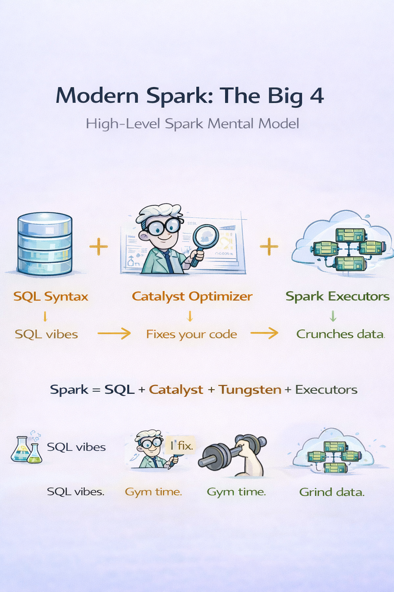

## **Topic 7 - Spark SQL & the Catalyst Optimizer (the secret brain)**

Modern Spark is basically:

> SQL engine + distributed execution + optimizer on steroids

This is why **Apache Spark** works best when you stay high-level.

---

---
### Spark SQL: not “just SQL”

Spark SQL is:
- a unified engine
- used by SQL queries
- used by DataFrames
- used by most Spark APIs under the hood

Whether you write:
- SQL
- DataFrame code
- transformations in Scala/Python

Spark converts it all into the **same internal plan**.

Different syntax. Same engine.

---
### SQL gets compiled into Spark jobs

A Spark SQL query becomes:

- One or more **Spark jobs**
- Each job → stages
- Each stage → tasks
- Tasks → run on executors

So SQL is **not interpreted**, it’s **compiled into a distributed execution plan**.

That’s a huge mental shift if you’re coming from RDBMS.

---
### Schema-on-read, not schema-on-write

Databases enforce schema at write time.  
Spark SQL often enforces schema at **read time**.

Why this matters:
- You can evolve schemas
- You can ingest messy data
- You validate structure during processing

This is why Spark is loved in data lakes.

---
### SQL is a _control plane_, not storage

Spark SQL:
- Does not own data
- Does not manage indexes like OLTP DBs
- Does not guarantee low-latency single-row lookups

It’s built for:
- Scans
- Aggregations
- Joins
- Analytics

If you treat it like MySQL, you’ll hate it.  
If you treat it like a distributed analytics engine, it shines.

---
### Catalyst Optimizer — Spark’s unfair advantage

Catalyst is Spark’s **query optimizer**.

It doesn’t run data.  
It **rewrites your logic**.

Pipeline looks like this:
1. Logical plan (what you asked for)
2. Optimized logical plan (what you _meant_)
3. Physical plan (how to execute it)
4. Execution (tasks & stages)

What Catalyst does:
- Converts SQL into a **Logical Plan**
- Applies rule-based optimizations
- Generates **multiple candidate plans**
- Picks the cheapest one

Think of Catalyst as:

> “You say _what_, I’ll decide _how_.”

We describe intent. Catalyst fixes your mistakes.

---
### What Catalyst actually does (real stuff)

Catalyst can:

- reorder filters before joins
- drop unused columns
- push filters into data sources
- combine multiple steps into one pass
- choose better join strategies

You might write inefficient code.  
Spark silently makes it better.

This is why DataFrames > RDDs.

---
### Predicate pushdown (huge win)

If you filter data early, Spark tries to:

- push that filter down into storage
- read less data in the first place

Instead of:

> read everything → then filter

Spark aims for:

> read only what matters

This saves I/O, CPU, time, money, sanity.

---
### Physical plans & join strategies

Spark doesn’t always join the same way.

Depending on data size, it may choose:

- broadcast join (small table sent to all executors)
- sort-merge join (large + large)
- shuffled hash join

You don’t hardcode this.  
Spark decides at runtime.

Unless you fight it. Then Spark fights back.

---
### Why RDDs miss out

RDDs:

- hide structure
- expose raw functions
- block optimization

Spark can’t reason about “columns” inside RDDs.

No schema → no Catalyst magic.

That’s why RDD-heavy code usually underperforms.

---
### Debugging superpower: explain plans

Spark can show:

- logical plan
- optimized plan
- physical plan

Reading these feels alien at first.  
Then it becomes X-ray vision.

This is how we debug performance.

---
### Tungsten = close to the metal

Spark SQL doesn’t just optimize queries — it optimizes **CPU and memory usage**.

Tungsten does:
- Off-heap memory management
- Cache-friendly binary formats
- Whole-stage code generation (actual Java bytecode)

Result:
- Fewer objects
- Less GC pressure
- Faster execution

This is why Spark SQL can beat naïve MapReduce jobs by miles.

---

---
### Mental shift to lock in

- Spark is a **compiler**, not a script runner
- High-level code = more optimization
- Trust Catalyst before micro-optimizing
- If Spark surprises you, read the plan

### One-line mental model

**Spark SQL = SQL syntax + Catalyst optimizer + Tungsten execution + Spark’s distributed engine**

Or in terms:

> SQL is the vibe. Catalyst runs the playbook. Tungsten hits the gym. Executors do the grind.

