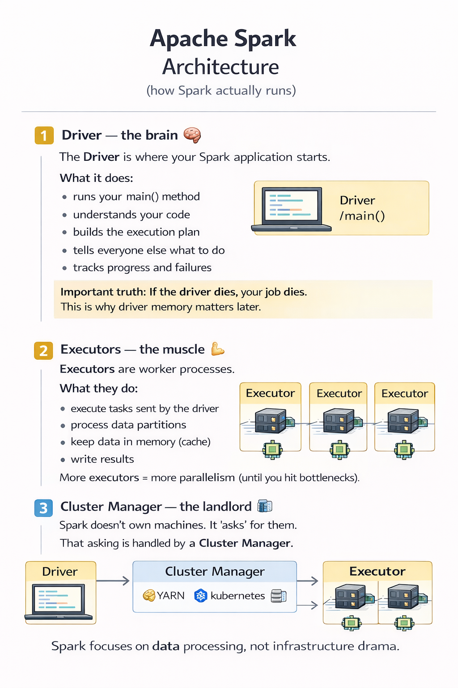
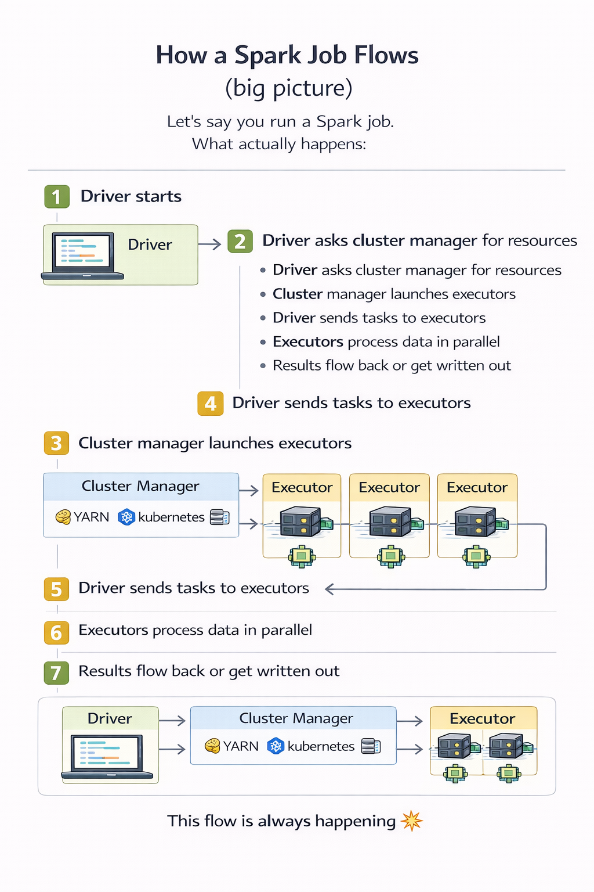

## **Topic 2 - Apache Spark Architecture (how Spark actually runs)**

### 1) Driver — the brain

The **Driver** is where your Spark application starts.
**What it does:**
- runs your `main()` method
- understands your code
- builds the execution plan
- tells everyone else what to do
- tracks progress and failures

Important truth:  
If the **driver dies**, your job dies.  
This is why driver memory matters later.

---
### 2) Executors — the muscle

**Executors** are worker processes.
**What they do:**
- execute tasks sent by the driver
- process data partitions
- keep data in memory (cache)
- write results

**Each executor:**
- runs on a worker node
- has its own CPU + memory
- works independently

More executors = more parallelism (until you hit bottlenecks).

---
### 3) Cluster Manager — the landlord

Spark doesn’t own machines. It **asks** for them.
That asking is handled by a **Cluster Manager**.

**Types:**
- YARN
- Kubernetes
- Standalone (Spark’s built-in, mostly for learning)

**The cluster manager:**
- allocates CPUs and memory
- launches executors
- monitors resources

Spark focuses on _data processing_, not infrastructure drama.

---
### How a Spark job flows (big picture)

Let’s say you run a Spark job.

**What actually happens:**

1. Driver starts
2. Driver asks cluster manager for resources
3. Cluster manager launches executors
4. Driver sends tasks to executors
5. Executors process data in parallel
6. Results flow back or get written out
7. Job completes (or explodes loudly)

This flow is **always happening**.

---
**Mental Model**
- Driver plans and coordinates
- Executors execute tasks
- Cluster manager allocates resources
- Driver failure = job failure