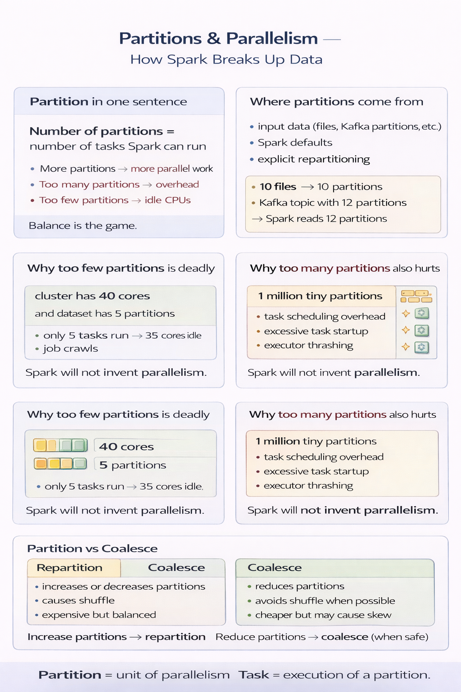

## **Topic 6 - Partitions & Parallelism (Spark’s performance lever)**

Spark doesn’t process data row by row.  
It processes **partitions**.

A **partition** is:
- a chunk of your dataset
- processed by **one task**
- on **one executor core**
---
### Parallelism in one sentence

**Number of partitions = number of tasks Spark can run**

More partitions → more parallel work  
Too many partitions → overhead  
Too few partitions → idle CPUs

Balance is the game.

---
### Where partitions come from

Partitions are created by:
- input data (files, Kafka partitions, etc.)
- Spark defaults
- explicit repartitioning

Examples:

- 10 files → often ~10 partitions
- Kafka topic with 12 partitions → Spark reads 12 partitions
- A bad join → suddenly 1 giant partition (ouch)
---
### Why “too few partitions” is deadly

Scenario:

- cluster has 40 cores
- dataset has 5 partitions

Result:

- only 5 tasks run
- 35 cores sit idle
- job crawls

Spark is fast, but it won’t invent parallelism.

---
### Why “too many partitions” also hurts

Scenario:

- 1 million tiny partitions

Result:

- task scheduling overhead
- excessive task startup
- executor thrashing

Spark spends more time managing tasks than doing work.

---
### Repartition vs Coalesce (conceptual)

- **Repartition**
    - increases or decreases partitions
    - causes a shuffle
    - expensive but balanced
- **Coalesce**    
    - reduces partitions
    - avoids shuffle when possible
    - cheaper but can cause skew

Rule of thumb:
- increase partitions → repartition
- reduce partitions → coalesce (when safe)
---
### The silent killer: Data Skew
Data skew happens when:
- one partition is huge
- others are tiny

Symptoms:
- one task runs forever
- others finish fast
- job “hangs at 99%”

Causes:
- bad join keys
- uneven data distribution
- hot keys (e.g., same userId everywhere)

Skew is not a Spark bug.  
It’s a data reality problem.

---

---
**Mental Model**
- Partition = unit of parallelism
- One partition → one task
- Too few = idle CPUs
- Too many = overhead
- Partitioning beats micro-optimizations
