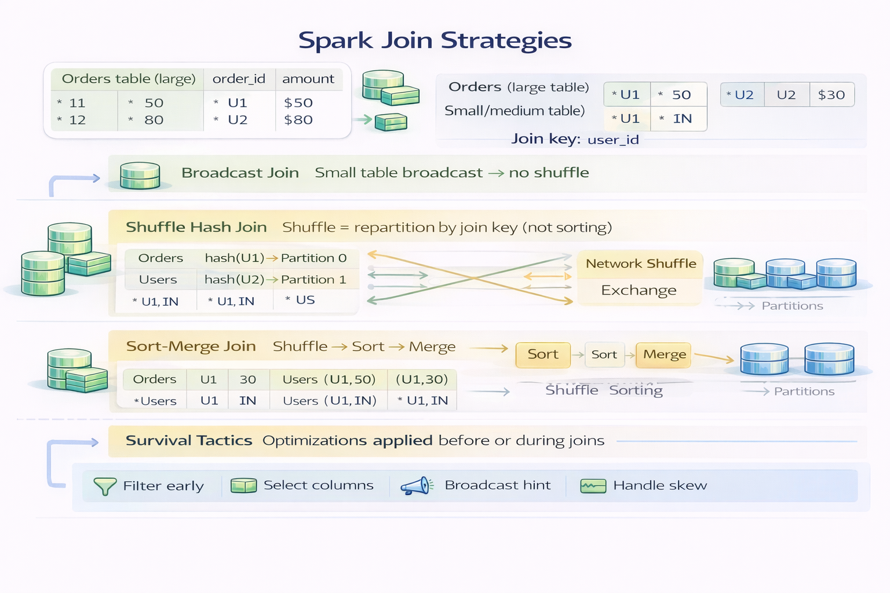

## **Topic 8 - Spark Joins (broadcast, shuffle, and survival tactics)**

> - A join is where Spark stops being polite and starts moving data around the cluster.
> 
> - **Broadcast** means Spark **copies a small table to every executor** and joins it locally with partitions of the big table.
---
### Why joins are expensive (physics, not Spark)

A join means:
- data from different partitions must meet
- records with the same key must land together
- this usually means **data movement**

Data movement = network + disk + coordination.

That’s the cost.

---
### Join strategy #1 — Broadcast join (Bring the small table to everyone)

A **broadcast join** ships the **small table** to **every executor**, keeps it in memory, and joins it locally with each partition of the big table.

No shuffle. No network chaos during execution.

Definition in human terms:  
> **Copy the tiny dataset everywhere so the big dataset never moves.**

Why it’s fast:
- Zero shuffle
- Pure in-memory lookup
- CPU-bound instead of network-bound

- If one dataset is **small**, Spark can:
	- copy it to every executor
	- avoid shuffling the big dataset
	- join locally inside each executor

This is insanely fast.

Why it’s risky:
- If the “small” table isn’t actually small → executor OOM and the job dies dramatically
- Think:
	- fact table = huge
	- dimension table = tiny

Rule of thumb:
- Dimension tables
- Lookups
- Anything comfortably under memory limits
---
#### When broadcast joins fail

Broadcast is amazing until:
- the “small” table isn’t actually small
- executor memory explodes
- job dies spectacularly

Broadcast is power. Power needs restraint.

---
### Join strategy #2 — Shuffle join (Everyone reshuffle and meet in the middle)

A **shuffle join** repartitions **both datasets** by the join key so matching keys land on the same executor.

This is Spark’s default when it can’t broadcast.

> **Both tables move across the network so rows with the same key can find each other.**

Why it works:
- Handles large datasets
- No size assumptions

Why it’s expensive:
- Massive network I/O
- Disk spills
- Slow stages
- Stragglers ruin your day

Typical use:
- Fact ↔ fact joins
- Large ↔ large joins
- When memory is limited

This is the join that makes Spark feel “slow” when misused.

---
### Join strategy #3 — Sort-merge join (common reality)

Spark often chooses **sort-merge join** for big datasets.

Sort-merge join = **shuffle first, then sort inside each partition, then merge**
- sorts both sides by key
- merges them efficiently

Better than naive joins. Still heavy.

---

>**Shuffle decides where data goes.**
>**Sort decides how data is processed once it gets there.**

---
### The silent enemy: skewed join keys

If one key appears a lot:
- one partition becomes massive
- one task runs forever
- cluster waits

Classic example:
- `country = "US"`
- `status = "ACTIVE"`

Skew makes Spark look broken. It’s not.

---
### Practical survival rules
- Always know which side is small
- Let Spark broadcast automatically when possible    
- Reduce data _before_ joins
- Avoid joining raw, unfiltered datasets
- Watch for skewed keys

Joins reward preparation and punish optimism.

---

---

**Mental Model**
- Joins move data across cluster
- Broadcast small datasets
- Big joins cause shuffles
- Skewed keys create stragglers
- Joining is not a “line of code”.  
- It’s a **cluster-wide operation**.
- Every join is a design decision.